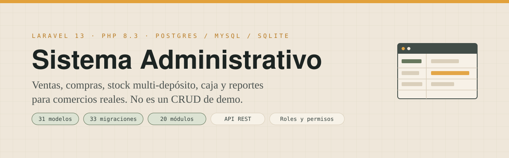
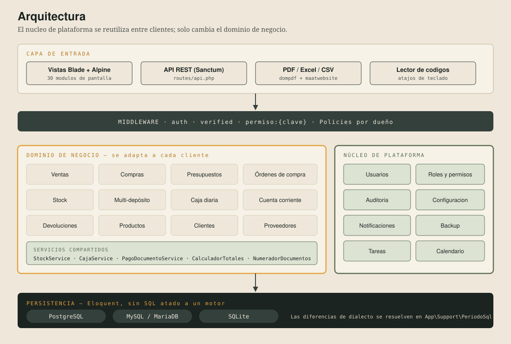
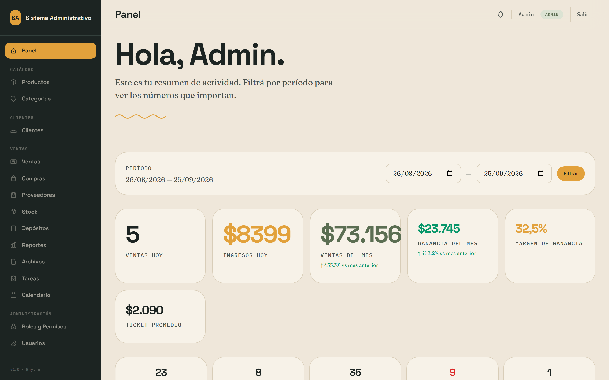
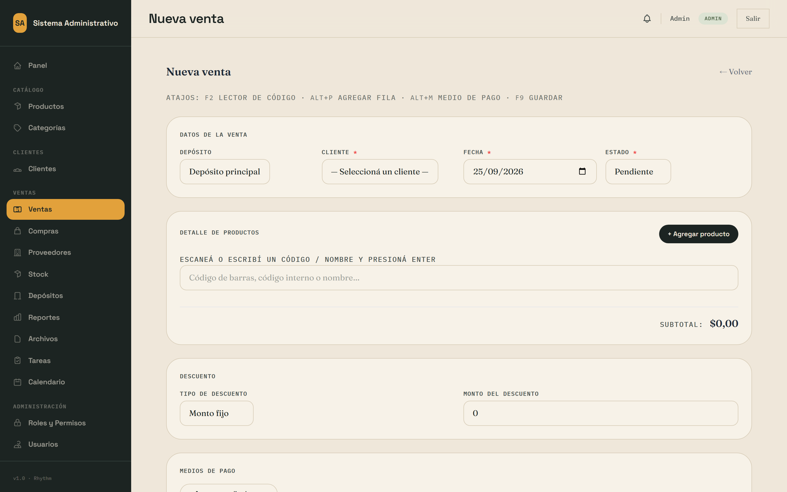
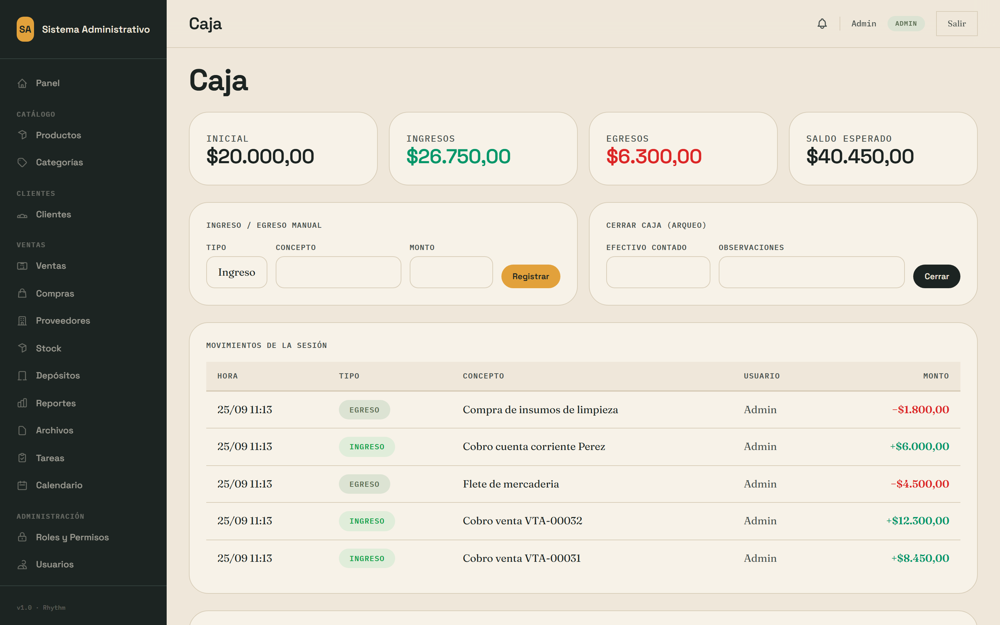
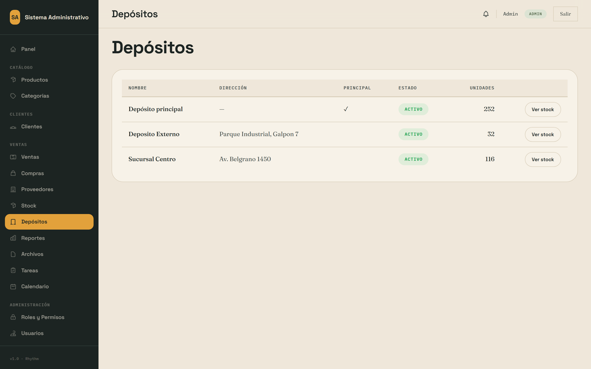
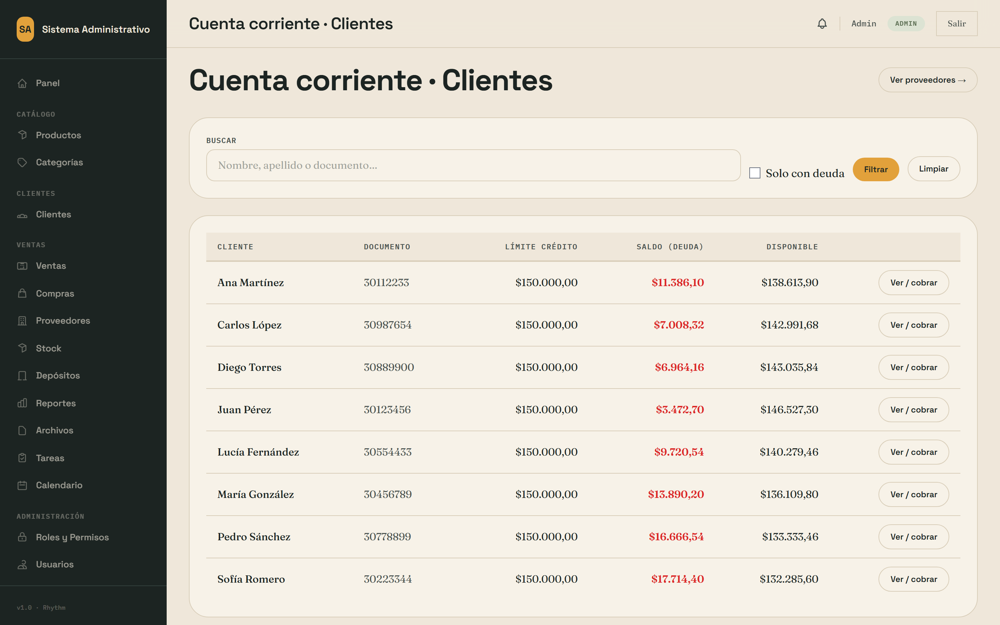
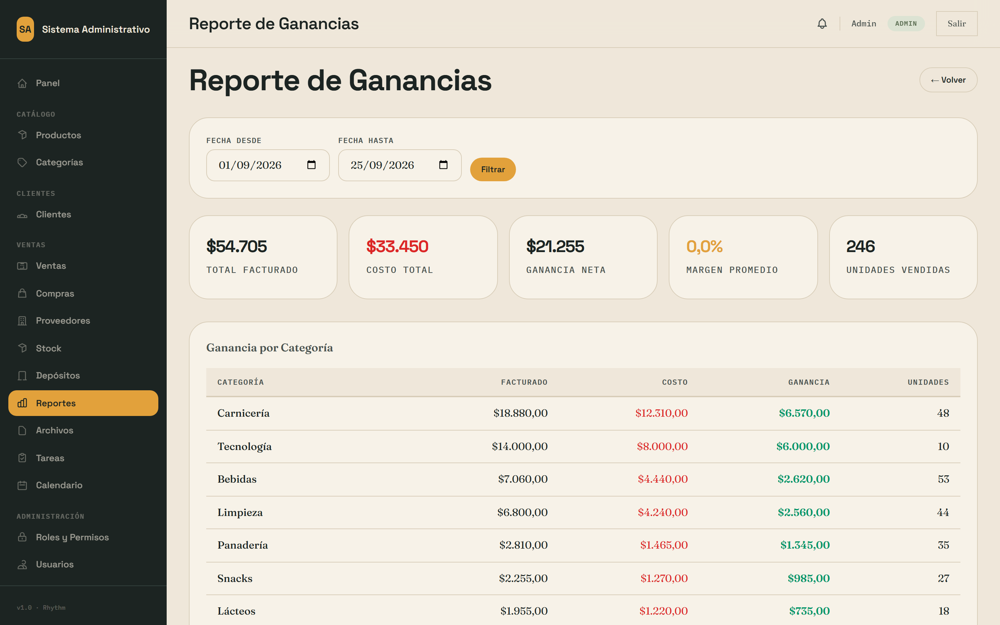
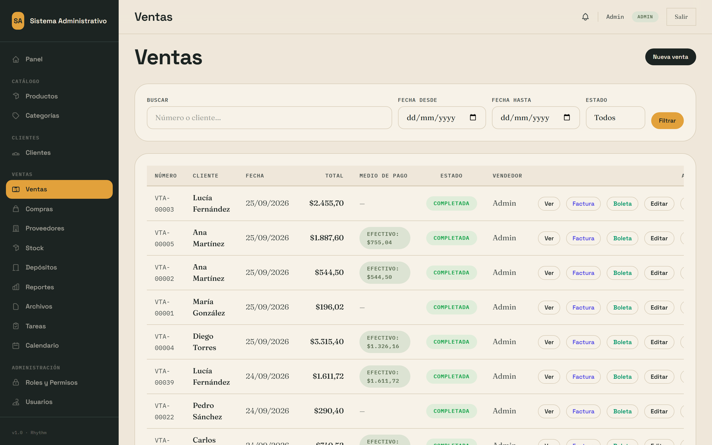
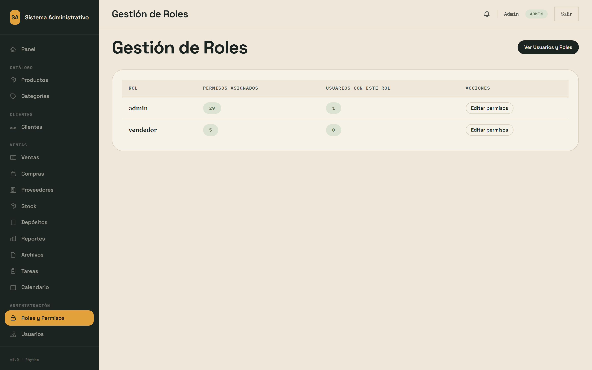

<p align="center">
  
</p>

<p align="center">
  <a href="https://github.com/joaquinyunes/CRUD/actions/workflows/ci.yml"></a>
  
  
  
  
</p>

# Sistema Administrativo

Sistema de gestión para comercios: **vender, comprar, controlar stock en varios depósitos, cerrar la
caja del día, llevar la cuenta corriente de clientes y proveedores, y sacar reportes de rentabilidad.**

No es un CRUD de ejemplo. Es un sistema con reglas de negocio reales: el stock no se puede sobrevender,
los comprobantes se numeran de forma consecutiva y sin huecos, una venta anulada devuelve el stock sin
borrar el historial, una orden de compra se puede recibir parcialmente, y cada movimiento queda
auditado con el usuario que lo hizo.

Está pensado para adaptarse a distintos rubros —ferretería, kiosco, distribuidora, taller, local de
ropa— cambiando el dominio de negocio y reutilizando el núcleo de usuarios, roles, permisos y auditoría.

---

## Demo

| | |
|---|---|
| **URL** | **https://crud-erp.onrender.com** |
| **Usuario** | `admin@admin.com` |
| **Contraseña** | `password` |

La demo se carga con `DemoSeeder`: categorías, productos con stock real, clientes, proveedores, ventas,
compras, caja abierta con movimientos del día y cuenta corriente con saldos, para que se vea
funcionando desde el primer minuto.

> Corre en el plan gratuito de Render: la primera visita después de un rato de inactividad tarda
> entre 30 y 60 segundos en levantar el contenedor.

---

## Qué resuelve

### Ventas
Venta con varias líneas, descuento por monto o porcentaje, impuesto configurable, varios métodos de
pago en la misma operación y venta a cuenta corriente. Búsqueda de productos por código de barras con
atajos de teclado para operar sin mouse.

### Compras y proveedores
Compras con recepción de mercadería, y órdenes de compra con **recepción parcial**: se recibe lo que
llegó y la orden queda abierta por el resto, con facturación posterior.

### Stock multi-depósito
Stock por depósito, transferencias entre depósitos y trazabilidad completa: cada entrada, salida,
ajuste y devolución queda registrada como un movimiento con su documento de origen.

### Caja diaria
Apertura de caja, movimientos de ingreso y egreso, y arqueo de cierre con la diferencia entre lo
declarado y lo esperado.

### Cuenta corriente
Saldo de clientes y proveedores, imputación de pagos a comprobantes concretos y estado de cuenta
exportable.

### Devoluciones y notas de crédito
Devoluciones de venta y de compra que reingresan o descuentan stock según corresponda, sin romper el
historial del comprobante original.

### Presupuestos
Presupuesto con fecha de vencimiento y **conversión a venta** en un click, respetando los precios
acordados.

### Reportes
Ventas y compras por día, semana y mes; productos más vendidos; mejores clientes; ranking de
proveedores; stock crítico; y rentabilidad con margen por producto y por categoría.

### Núcleo de plataforma
Roles y permisos por módulo, auditoría de cambios, configuración del negocio, notificaciones, tareas,
calendario, backup e importación/exportación en Excel y CSV.

Todo el sistema se puede operar también por **API REST** (Sanctum), no sólo por la interfaz web. Los
comprobantes se emiten en **PDF** y los listados se exportan a **Excel** y **CSV**.

---

## Arquitectura

<p align="center">
  
</p>

### Decisiones técnicas que vale la pena mirar

| Decisión | Por qué | Dónde |
|---|---|---|
| **Un solo punto de cálculo de totales** | La fórmula de subtotal, descuento, base imponible e impuesto estaba duplicada en ventas y compras y se desincronizaba. Ahora hay una sola implementación, con tests. | `app/Support/CalculadorTotales.php` |
| **Numeración de comprobantes centralizada** | Los números consecutivos sin huecos se generan en un único lugar, dentro de la transacción, para que dos ventas simultáneas no tomen el mismo número. | `app/Support/NumeradorDocumentos.php` |
| **El stock se mueve en servicios, no en controllers** | Toda alta, baja o ajuste pasa por el servicio de stock, que valida disponibilidad y deja el movimiento auditado. Ningún controller toca `productos.stock` a mano. | `app/Services/StockService.php` |
| **Anular en vez de borrar** | Una venta anulada conserva el comprobante y revierte el stock. Nunca se pierde el historial. | `VentaController@anular` |
| **SQL independiente del motor** | Los reportes agrupaban con `YEARWEEK()` y `DATE_FORMAT()`, exclusivas de MySQL. El dialecto se resuelve en un solo lugar y el CI corre los tests contra los tres motores. | `app/Support/PeriodoSql.php` |
| **Permisos por clave, no roles hardcodeados** | El middleware pide `permiso:ventas.crear`. Se pueden crear roles nuevos sin tocar código. | `routes/*.php` |
| **Rutas separadas por módulo** | 30 archivos de rutas en lugar de un `web.php` de 800 líneas. | `routes/` |

---

## Capturas

| Panel de control | Nueva venta |
|---|---|
|  |  |
| Métricas del mes, margen real y gráficos | Carga por código de barras y totales en vivo |

| Caja diaria | Stock multi-depósito |
|---|---|
|  |  |
| Apertura, movimientos y arqueo de cierre | Unidades por depósito y transferencias |

| Cuenta corriente | Rentabilidad |
|---|---|
|  |  |
| Saldos de clientes e imputación de pagos | Margen por producto y por categoría |

| Listado de ventas | Roles y permisos |
|---|---|
|  |  |
| Filtros, estados de pago y anulación | Permisos por módulo, sin roles hardcodeados |

Las capturas se regeneran solas contra una instancia local con datos de demo:

```bash
npm install playwright && npx playwright install chromium
node docs/capturas.cjs
```

---

## Instalación

### Opción 1 — Local en 2 minutos (SQLite, sin servidor de base de datos)

```bash
git clone https://github.com/joaquinyunes/CRUD.git
cd CRUD
composer install
cp .env.example .env
php artisan key:generate
touch database/database.sqlite
php artisan migrate --seed
php artisan db:seed --class=DemoSeeder
npm install && npm run build
php artisan serve
```

Entrar a http://localhost:8000 con `admin@admin.com` / `password`.

### Opción 2 — Docker (PostgreSQL incluido, sin instalar PHP)

```bash
docker compose run --rm app php artisan key:generate --show
```

Copiar el valor —con el prefijo `base64:`— a un archivo `.env` como `APP_KEY=...` y levantar:

```bash
docker compose up --build
```

Queda en http://localhost:8080 con los datos de demo ya cargados.

### Opción 3 — MySQL / MariaDB

Descomentar el bloque de MySQL en `.env` y correr `php artisan migrate --seed`.

---

## Deploy en Render

El repositorio trae un [blueprint de Render](render.yaml) que crea el servicio web y la base
PostgreSQL ya enlazados entre sí.

1. **Render → New → Blueprint** y conectar este repositorio.
2. Render detecta `render.yaml` y propone el web service más la base Postgres.
3. Cargar la única variable que Render no puede generar:

   ```bash
   php artisan key:generate --show
   ```

   Pegar el resultado completo en la variable de entorno `APP_KEY`.
4. Deploy. El primer arranque corre las migraciones y, con `DB_SEED_ON_BOOT=true`, carga los datos de
   demostración.

Para la instalación real de un cliente, poner `DB_SEED_ON_BOOT=false`.

> **Sobre Vercel:** no es el lugar para este sistema. Vercel es serverless: no hay proceso
> persistente, ni sistema de archivos escribible para `storage/`, ni base de datos relacional propia.
> Las sesiones, los PDFs generados, los archivos adjuntos y las colas dejarían de funcionar. Render
> —o cualquier VPS con Docker— es la opción correcta.

---

## Tests

```bash
php artisan test
```

La suite cubre las reglas que importan, no getters y setters:

- el stock se descuenta al confirmar una venta y se repone al anularla;
- no se puede vender más stock del disponible;
- los totales con descuento e impuesto dan lo que tienen que dar;
- la numeración de comprobantes no deja huecos;
- la caja cierra con la diferencia correcta;
- la cuenta corriente imputa cada pago al comprobante correcto;
- una orden de compra recibida parcialmente queda abierta por el resto;
- un vendedor no puede ver ni editar las ventas de otro;
- los reportes por período funcionan en SQLite, MySQL y PostgreSQL.

El CI corre la suite contra los **tres motores de base de datos** y verifica el estilo con Pint.

---

## API REST

Autenticación con Laravel Sanctum. Los módulos de negocio exponen los mismos casos de uso que la
interfaz web, con la misma validación de stock y la misma numeración de comprobantes.

```bash
curl -X POST https://tu-dominio/api/ventas \
  -H "Authorization: Bearer $TOKEN" \
  -H "Content-Type: application/json" \
  -d '{
        "cliente_id": 1,
        "fecha": "2026-09-24",
        "detalles": [{"producto_id": 5, "cantidad": 2, "precio": 180}]
      }'
```

Ver [`routes/api.php`](routes/api.php).

---

## Estructura

```
app/
  Http/Controllers/     30 controllers web + API
  Models/               31 modelos Eloquent
  Services/             StockService, CajaService, PagoDocumentoService
  Support/              CalculadorTotales, NumeradorDocumentos, PeriodoSql
  Policies/             autorización por dueño del comprobante
  Traits/Auditable      registro automático de cambios
database/
  migrations/           33 migraciones
  seeders/DemoSeeder    datos de demostración realistas
routes/                 30 archivos, uno por módulo
resources/views/        Blade + Alpine, design system propio (public/css/rhythm.css)
tests/Feature/          reglas de negocio
docker/ Dockerfile render.yaml docker-compose.yml
```

---

## Stack

- **Backend:** Laravel 13 · PHP 8.3 · Eloquent · Sanctum
- **Frontend:** Blade · Alpine.js · Tailwind · design system propio
- **Base de datos:** PostgreSQL, MySQL/MariaDB o SQLite
- **Documentos:** dompdf (PDF) · maatwebsite/excel (Excel, CSV)
- **Infraestructura:** Docker (FrankenPHP) · Render · GitHub Actions

---

## Licencia y uso comercial

Este proyecto es **source available**, no open source: se puede leer, clonar y evaluar libremente,
pero usarlo para operar un negocio requiere una licencia comercial. Ver [LICENSE](LICENSE).

**¿Necesitás este sistema para tu comercio?** Se entrega instalado, con los módulos adaptados a tu
rubro, migración de los datos que ya tenés y capacitación. Contacto:
[github.com/joaquinyunes](https://github.com/joaquinyunes).
